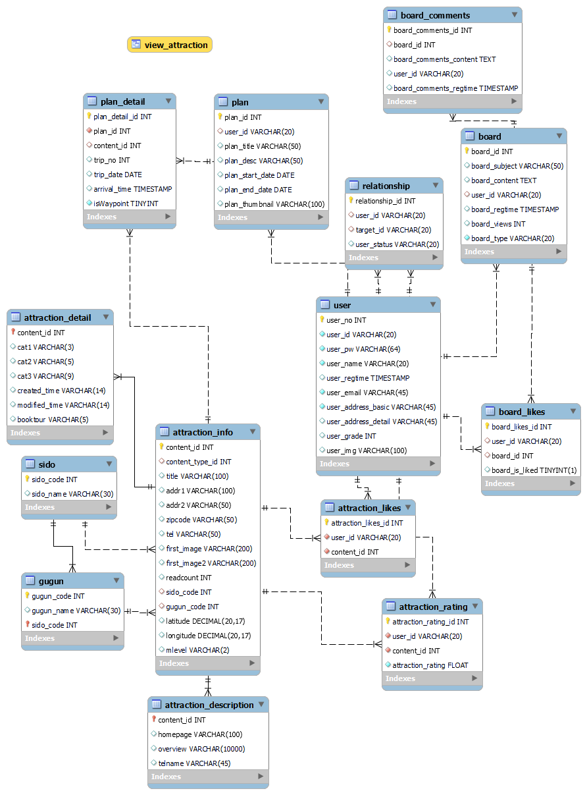
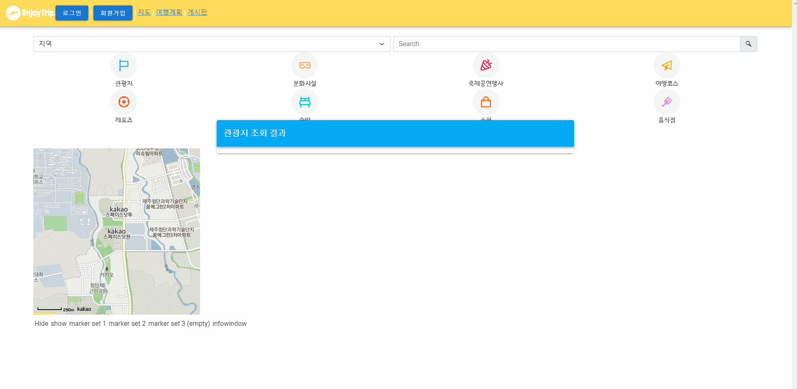
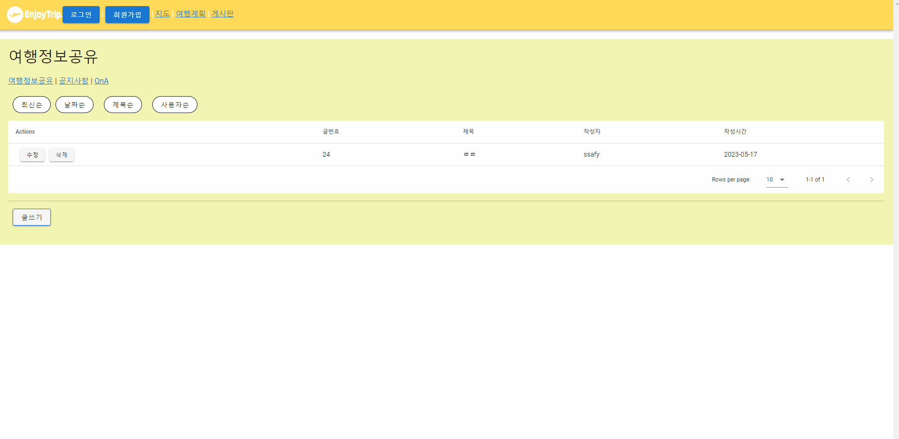
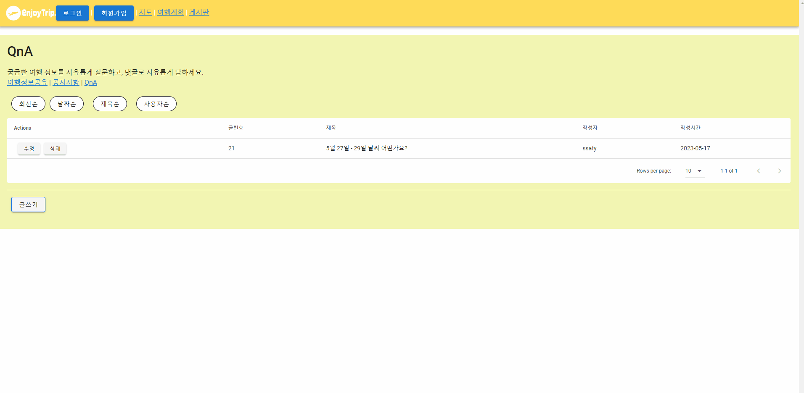

# EnjoyTrip_DB_서울_11_최효빈_이강희
[티저 동영상 링크](https://www.youtube.com/watch?v=Zujd17yREBY)

 

# 팀원 소개

| 팀원   | 역할 |
| ------ | ------ |
| 최효빈 | 팀장, DB 설계, 화면 설계, 여행 계획/여행지 포토리뷰 등 공공데이터 연동 기능 구현 | 
| 이강희 | 게시판 구현, JWT 로그인 구현, ChatGPT 연동 구현|

# 1. 요구사항 구현 목록  

| 순번 | 요구사항명               | 요구사항 상세 |
| :--: | :----------------------: | :-----------: | 
|  F01  | 지역별 관광지 정보 수집   |   한국관광공사 : 지역별 관광지 정보를 얻어와 화면에 표시    | 
|    F02  |관광지, 숙박, 음식점 조회    |  관광지 정보를 지역별 원하는컨텐츠 별 조회    | 
|   F03  | 문화시설, 공연, 여행코스, 쇼핑조회                |   관광지 정보를 지역별 원하는 컨텐츠 별 조회     | 
|  F04  | 게시판 등록   |    게시판 등록/수정/삭제/조회    | 

# 2. 다이어그램
## 2.1. ER Diagram 

 

# 3. 기능 구현 시연

## 3.1. 메인 페이지 구성

 

## 3.2. 관광지 정보 조회 (지역별, 유형별)

 

## 3.3. 게시판
### 3.3.1 게시판 (여행정보 공유, 공지사항)

### 3.3.2 게시판 (Q&A)

 

## 3.4. Hotplace

마음에 드는 관광지에 '좋아요' 표시 후 메인 화면에 표시

